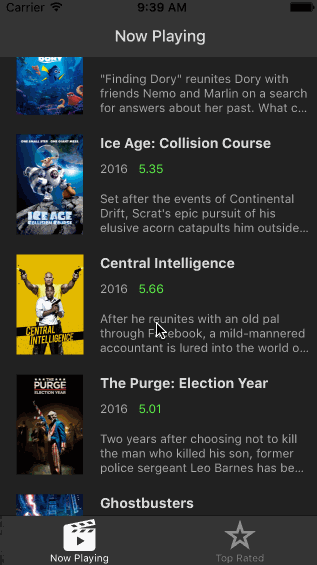
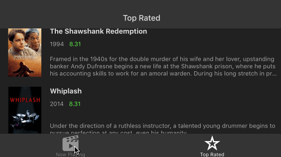
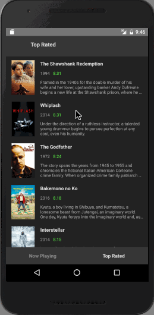

# React Native Flixster Final Version Example

**Flixster** shows the latest movies currently playing in theaters.
The app utilizes the Movie Database API to display images and basic information about these movies to the user.
React Native is used with the goal of making as close to the same experience as possible on both iOS and Android environments.

## Video Walkthrough

GIF created with [LiceCap](http://www.cockos.com/licecap/).
